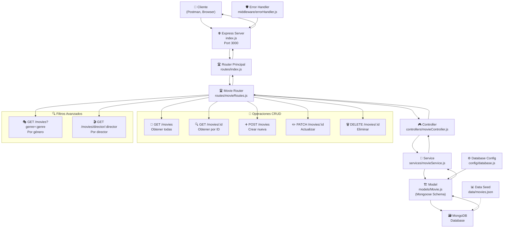

# 🎬 API de Películas con Mongoose y Express

Una **API REST** moderna para gestionar una base de datos de películas utilizando **Node.js**, **Express** y **MongoDB** con **Mongoose**.

---

## 📋 Tabla de Contenidos

- [🎬 API de Películas con Mongoose y Express](#-api-de-películas-con-mongoose-y-express)
  - [📋 Tabla de Contenidos](#-tabla-de-contenidos)
  - [✨ Características](#-características)
  - [🚀 Instalación](#-instalación)
    - [1. Clonar el repositorio](#1-clonar-el-repositorio)
    - [2. Instalar dependencias](#2-instalar-dependencias)
    - [3. Configurar variables de entorno](#3-configurar-variables-de-entorno)
    - [4. Iniciar la aplicación](#4-iniciar-la-aplicación)
  - [⚙️ Configuración](#️-configuración)
    - [Opciones de conexión recomendadas:](#opciones-de-conexión-recomendadas)
  - [🏗️ Arquitectura del Proyecto](#️-arquitectura-del-proyecto)
    - [📊 Diagrama de Arquitectura](#-diagrama-de-arquitectura)
  - [📡 Endpoints de la API](#-endpoints-de-la-api)
    - [🎯 Operaciones CRUD Básicas](#-operaciones-crud-básicas)
    - [🔍 Endpoints de Filtrado](#-endpoints-de-filtrado)
    - [📊 Códigos de Respuesta HTTP](#-códigos-de-respuesta-http)
  - [📊 Modelo de Datos](#-modelo-de-datos)
    - [Ejemplo de película válida:](#ejemplo-de-película-válida)
  - [🧪 Pruebas con API HTTP](#-pruebas-con-api-http)
    - [➕ Crear una nueva película](#-crear-una-nueva-película)
    - [✏️ Actualizar una película existente](#️-actualizar-una-película-existente)
    - [🗑️ Eliminar una película](#️-eliminar-una-película)
  - [🔧 Scripts Disponibles](#-scripts-disponibles)
  - [📝 Lista de Tareas del Proyecto](#-lista-de-tareas-del-proyecto)
    - [🚀 Funcionalidades Básicas](#-funcionalidades-básicas)
    - [🔍 Mejoras Pendientes](#-mejoras-pendientes)
    - [🛡️ Seguridad y Producción](#️-seguridad-y-producción)
    - [📊 Funcionalidades Avanzadas](#-funcionalidades-avanzadas)
    - [🧪 Testing y Calidad](#-testing-y-calidad)
  - [⚡ Tecnologías](#-tecnologías)
    - [Backend](#backend)
    - [Base de Datos](#base-de-datos)
    - [Herramientas de Desarrollo](#herramientas-de-desarrollo)
    - [Dependencias principales](#dependencias-principales)
  - [📝 Notas Importantes](#-notas-importantes)
    - [Arquitectura MVC + Services](#arquitectura-mvc--services)
    - [Middleware](#middleware)
    - [Estructura de respuestas](#estructura-de-respuestas)
  - [🤝 Contribución](#-contribución)
    - [🎬 ¡Disfruta gestionando tu colección de películas! 🍿](#-disfruta-gestionando-tu-colección-de-películas-)

---

## ✨ Características

> [!NOTE]  
> Esta API implementa un patrón **MVC** (Modelo-Vista-Controlador) para una mejor organización del código.

- ✅ **CRUD Completo** para gestión de películas
- 🔍 **Filtrado avanzado** por género y director
- 🗃️ **Base de datos MongoDB** con Mongoose ODM
- 🏗️ **Arquitectura MVC + Services** bien estructurada
- 🛡️ **Manejo centralizado de errores** con middleware personalizado
- 🚀 **Hot reload** en desarrollo con Node --watch
- 📡 **RESTful API** siguiendo mejores prácticas
- 🔧 **Validación** de datos con Mongoose schemas
- 🔄 **Separación de responsabilidades** entre controladores y servicios

---

## 🚀 Instalación

> [!IMPORTANT]  
> Asegúrate de tener **Node.js** (versión 18 o superior) y **MongoDB** instalados en tu sistema.

<details>
<summary><strong>📝 Pasos de instalación detallados</strong></summary>

### 1. Clonar el repositorio
```bash
git clone <url-del-repositorio>
cd "arq ff"
```

### 2. Instalar dependencias
```bash
# Usando pnpm (recomendado)
pnpm install

# O usando npm
npm install
```

### 3. Configurar variables de entorno
Crea un archivo `.env` en la raíz del proyecto:
```env
DB_PROTOCOL=mongodb
DB_HOST=localhost:27017
DB_USER=tu_usuario
DB_PASS=tu_contraseña
DB_NAME=movies_db
```

### 4. Iniciar la aplicación
```bash
# Modo desarrollo (con hot reload)
pnpm dev

# Modo producción
pnpm start
```

</details>

---

## ⚙️ Configuración

> [!WARNING]  
> **No olvides configurar las variables de entorno** antes de ejecutar la aplicación.

La aplicación se ejecuta por defecto en el puerto **3000**. Puedes acceder a ella en:
```
http://localhost:3000
```

<details>
<summary><strong>🔧 Configuración de MongoDB</strong></summary>

La conexión a MongoDB se configura a través de variables de entorno en el archivo `config/database.js`:

```javascript
const MONGODB_URI = `${DB_PROTOCOL}://${DB_USER}:${DB_PASS}@${DB_HOST}/${DB_NAME}`;
```

### Opciones de conexión recomendadas:
- **Local:** `mongodb://localhost:27017/movies_db`
- **MongoDB Atlas:** Usar la cadena de conexión proporcionada por Atlas
- **Docker:** `mongodb://mongodb:27017/movies_db`

</details>

---

## 🏗️ Arquitectura del Proyecto

```
arq ff/
├── 📄 index.js                  # Punto de entrada principal
├── 📋 package.json              # Dependencias y scripts
├── 📚 README.md                 # Documentación principal
└── 📁 src/
    ├── ⚙️  config/
    │   └── 📄 database.js       # Configuración de MongoDB
    ├── 🎮 controllers/
    │   └── 📄 movieController.js # Controladores de películas
    ├── 📊 data/
    │   └── 📄 movies.json       # Datos de ejemplo
    ├── 🛡️ middleware/
    │   └── 📄 errorHandler.js   # Manejo centralizado de errores
    ├── 🏗️ models/
    │   └── 📄 Movie.js          # Modelo de Mongoose
    ├── 🛣️ routes/
    │   ├── 📄 index.js          # Router principal
    │   └── 📄 movieRoutes.js    # Definición de rutas de películas
    ├── 🔧 services/
    │   └── 📄 movieService.js   # Lógica de negocio
    ├── 🧪 tests/
    │   └── 📄 api.http          # Pruebas HTTP
    └── 📚 readme.md             # Documentación técnica
```

> [!TIP]  
> La estructura sigue el patrón **MVC + Services** para mantener el código organizado y escalable, separando la lógica de negocio de los controladores.

### 📊 Diagrama de Arquitectura



> [!NOTE]  
> Este diagrama muestra el flujo completo de datos desde el cliente hasta la base de datos, pasando por todas las capas de la arquitectura MVC.

---

## 📡 Endpoints de la API

### 🎯 Operaciones CRUD Básicas

| Método | Endpoint | Descripción | Ejemplo |
|--------|----------|-------------|---------|
| `GET` | `/` | Página principal | `http://localhost:3000/` |
| `GET` | `/movies` | Obtener todas las películas | `http://localhost:3000/movies` |
| `GET` | `/movies/:id` | Obtener película por ID | `http://localhost:3000/movies/684b5bc648f3b1c63ff28829` |
| `POST` | `/movies` | Crear nueva película | `http://localhost:3000/movies` |
| `PATCH` | `/movies/:id` | Actualizar película | `http://localhost:3000/movies/684b5bc648f3b1c63ff28829` |
| `DELETE` | `/movies/:id` | Eliminar película | `http://localhost:3000/movies/684b5bc648f3b1c63ff28829` |

### 🔍 Endpoints de Filtrado

<details>
<summary><strong>Ver endpoints de filtrado avanzado</strong></summary>

| Método | Endpoint | Descripción | Ejemplo |
|--------|----------|-------------|---------|
| `GET` | `/movies?genre=:genre` | Filtrar por género | `http://localhost:3000/movies?genre=Romance` |
| `GET` | `/movies/director/:director` | Filtrar por director | `http://localhost:3000/movies/director/Christopher%20Nolan` |

</details>

### 📊 Códigos de Respuesta HTTP

| Código | Estado | Descripción | Cuándo se usa |
|--------|--------|-------------|---------------|
| `200` | ✅ **OK** | Operación exitosa | GET, PATCH exitosos |
| `201` | ✅ **Created** | Recurso creado exitosamente | POST exitoso |
| `400` | ❌ **Bad Request** | Datos inválidos o faltantes | Validación fallida |
| `404` | ❌ **Not Found** | Película no encontrada | ID inexistente |
| `422` | ❌ **Unprocessable Entity** | Error de validación de Mongoose | Datos no válidos |
| `500` | ❌ **Internal Server Error** | Error del servidor | Problemas de BD o servidor |

> [!NOTE]  
> Todos los endpoints devuelven JSON con la estructura: `{"data": [...], "message": "..."}` para respuestas exitosas y `{"error": "...", "status": number}` para errores.

---

## 📊 Modelo de Datos

> [!NOTE]  
> El esquema de datos está definido en `models/Movie.js` usando **Mongoose**.

<details>
<summary><strong>🎬 Estructura del modelo Movie</strong></summary>

```javascript
{
  title: {
    type: String,
    required: true          // ✅ Campo obligatorio
  },
  year: {
    type: Number,
    required: true          // ✅ Campo obligatorio
  },
  director: {
    type: String,
    required: true          // ✅ Campo obligatorio
  },
  duration: {
    type: Number,
    required: true          // ✅ Campo obligatorio (en minutos)
  },
  poster: {
    type: String            // 🔗 URL del poster (opcional)
  },
  genre: {
    type: [String],
    required: true          // ✅ Array de géneros obligatorio
  },
  rate: {
    type: Number,
    required: false,
    default: 5              // ⭐ Puntuación por defecto: 5
  }
}
```

### Ejemplo de película válida:
```json
{
  "title": "The Dark Knight",
  "year": 2008,
  "director": "Christopher Nolan",
  "duration": 152,
  "poster": "https://example.com/poster.jpg",
  "genre": ["Action", "Crime", "Drama"],
  "rate": 9.0
}
```

</details>

---

## 🧪 Pruebas con API HTTP

> [!TIP]  
> Utiliza el archivo `src/tests/api.http` incluido para probar todos los endpoints fácilmente.

<details>
<summary><strong>📝 Ejemplos de peticiones HTTP</strong></summary>

### ➕ Crear una nueva película
```http
POST http://localhost:3000/movies
Content-Type: application/json

{
    "title": "Mi película con Mongoose",
    "year": 2024,
    "director": "Tu Nombre",
    "duration": 120,
    "genre": ["Action", "Drama", "Crime"]
}
```

### ✏️ Actualizar una película existente
```http
PATCH http://localhost:3000/movies/6851fed7cb30539e30ee7f9b
Content-Type: application/json

{
    "duration": 222,
    "year": 2025,
    "rate": 8.5
}
```

### 🗑️ Eliminar una película
```http
DELETE http://localhost:3000/movies/6851f6ea8fb013ee9ba1a276
```

</details>

---

## 🔧 Scripts Disponibles

| Script | Comando | Descripción |
|--------|---------|-------------|
| **Desarrollo** | `pnpm dev` | Inicia el servidor con hot reload |
| **Producción** | `pnpm start` | Inicia el servidor en modo producción |
| **Test** | `pnpm test` | Ejecuta las pruebas (pendiente implementar) |

---

## 📝 Lista de Tareas del Proyecto

### 🚀 Funcionalidades Básicas
- [x] Configuración inicial del proyecto con Express y Mongoose
- [x] Modelo de datos para películas con validación
- [x] Endpoints CRUD completos (GET, POST, PATCH, DELETE)
- [x] Filtrado por género y director
- [x] Conexión a MongoDB con variables de entorno
- [x] Estructura MVC + Services implementada
- [x] Manejo centralizado de errores con middleware
- [x] Capa de servicios para separar lógica de negocio
- [x] Documentación completa con diagrama de arquitectura

### 🔍 Mejoras Pendientes
- [ ] Implementar sistema de autenticación JWT
- [ ] Agregar validación de entrada más robusta
- [ ] Implementar paginación para listado de películas
- [ ] Agregar endpoint de búsqueda por título
- [ ] Implementar filtrado por puntuación mínima
- [ ] Implementar rate limiting
- [ ] Agregar logging con Winston
- [ ] Implementar tests unitarios con Jest
- [ ] Agregar tests de integración
- [x] Implementar manejo de errores centralizado
- [ ] Agregar endpoint para subir imágenes de posters

### 🛡️ Seguridad y Producción
- [ ] Implementar helmet para headers de seguridad
- [ ] Agregar validación de CORS
- [ ] Implementar compresión de respuestas
- [ ] Configurar variables de entorno para producción
- [ ] Implementar backup automático de base de datos
- [ ] Configurar SSL/TLS
- [ ] Implementar monitoreo de la aplicación
- [ ] Agregar documentación de API con Swagger

### 📊 Funcionalidades Avanzadas
- [ ] Implementar sistema de favoritos
- [ ] Agregar comentarios y reseñas
- [ ] Implementar sistema de calificaciones por usuarios
- [ ] Agregar recomendaciones basadas en géneros
- [ ] Implementar cache con Redis
- [ ] Agregar notificaciones push
- [ ] Implementar API GraphQL como alternativa
- [ ] Agregar soporte para múltiples idiomas

### 🧪 Testing y Calidad
- [ ] Configurar ESLint y Prettier
- [ ] Implementar pre-commit hooks con Husky
- [ ] Agregar coverage de tests
- [ ] Implementar tests de performance
- [ ] Configurar CI/CD pipeline
- [ ] Agregar análisis de código estático

---

## ⚡ Tecnologías

<details>
<summary><strong>🛠️ Stack tecnológico utilizado</strong></summary>

### Backend
- **[Node.js](https://nodejs.org/)** - Runtime de JavaScript
- **[Express.js](https://expressjs.com/)** - Framework web minimalista
- **[Mongoose](https://mongoosejs.com/)** - ODM para MongoDB

### Base de Datos
- **[MongoDB](https://www.mongodb.com/)** - Base de datos NoSQL

### Herramientas de Desarrollo
- **[pnpm](https://pnpm.io/)** - Gestor de paquetes eficiente
- **Node --watch** - Hot reload nativo de Node.js

### Dependencias principales
```json
{
  "express": "^5.1.0",
  "mongoose": "^8.20.0"
}
```

</details>

---

## 📝 Notas Importantes

> [!IMPORTANT]  
> **Configuración de base de datos:** Asegúrate de que MongoDB esté ejecutándose antes de iniciar la aplicación.

> [!WARNING]  
> **Variables de entorno:** No subas tu archivo `.env` al repositorio. Usa `.env.example` para documentar las variables necesarias.

> [!CAUTION]  
> **Producción:** Esta configuración está pensada para desarrollo. Para producción, considera implementar:
> - Autenticación y autorización
> - Rate limiting
> - Validación de entrada más robusta
> - Logging avanzado
> - Manejo de errores mejorado

<details>
<summary><strong>🔍 Detalles técnicos adicionales</strong></summary>

### Arquitectura MVC + Services
El proyecto implementa una arquitectura en capas:
- **Routes** (`routes/movieRoutes.js`) - Define las rutas y endpoints
- **Controllers** (`controllers/movieController.js`) - Maneja las peticiones HTTP y respuestas
- **Services** (`services/movieService.js`) - Contiene la lógica de negocio y acceso a datos
- **Models** (`models/Movie.js`) - Define el esquema de Mongoose
- **Middleware** (`middleware/errorHandler.js`) - Manejo centralizado de errores

### Middleware
- `express.json()` - Parser de JSON para las peticiones POST/PATCH
- `errorHandler` - Middleware personalizado para manejo de errores (ValidationError, CastError, etc.)

### Estructura de respuestas
```javascript
// Respuesta exitosa (GET todas las películas)
[
  {
    "_id": "...",
    "title": "...",
    "year": 2024,
    ...
  }
]

// Respuesta exitosa (POST/PATCH)
{
  "_id": "...",
  "title": "...",
  ...
}

// Respuesta de error
{
  "message": "Descripción del error",
  "error": "Detalles del error"
}
```

</details>

---

## 🤝 Contribución

> [!NOTE]  
> ¡Las contribuciones son bienvenidas! Por favor, sigue estas pautas:

1. 🍴 Haz fork del proyecto
2. 🌿 Crea una rama para tu feature (`git checkout -b feature/nueva-funcionalidad`)
3. 💾 Commit tus cambios (`git commit -am 'Añade nueva funcionalidad'`)
4. 📤 Push a la rama (`git push origin feature/nueva-funcionalidad`)
5. 🔄 Abre un Pull Request

---

<div align="center">

### 🎬 ¡Disfruta gestionando tu colección de películas! 🍿

**Desarrollado con ❤️ usando Node.js, Express y MongoDB**

---

*¿Encontraste algún bug o tienes una sugerencia? ¡Abre un issue!* 🐛

</div>
